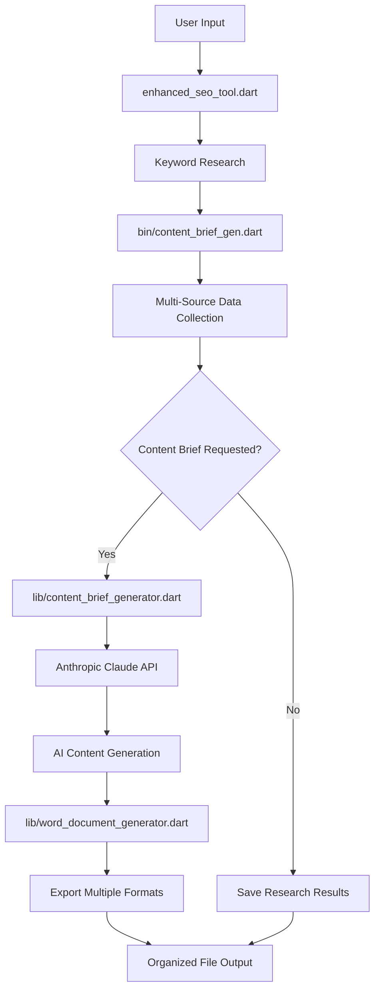

# 📁 Project Structure

```
content_brief_gen/
├── 📄 README.md                           # Main documentation
├── 🚀 QUICKSTART.md                       # 5-minute setup guide
├── 📋 CHANGELOG.md                        # Version history and updates
├── 🤝 CONTRIBUTING.md                     # Contribution guidelines
├── 📜 LICENSE                             # MIT License
├── 🔧 .gitignore                          # Git ignore rules
├── ⚙️ pubspec.yaml                        # Dart dependencies
├── 📊 enhanced_seo_tool.dart              # Main application entry point
│
├── 📂 bin/
│   └── content_brief_gen.dart             # Core keyword research engine
│
├── 📂 lib/
│   ├── content_brief_generator.dart       # AI content generation with Anthropic Claude
│   └── word_document_generator.dart       # Microsoft Word document export
│
├── 📂 docs/ (additional documentation)
│   ├── BATCH_PROCESSING.md               # Message Batches implementation guide
│   └── SSL_FIX_DOCUMENTATION.md          # SSL certificate fix details
│
├── 🔑 config.json.example                # API key configuration template
├── 🔑 .env.example                       # Environment variables template
│
├── 📂 results/                           # Generated keyword research reports
│   └── [timestamp-based-reports].txt
│
└── 📂 content_briefs/                    # AI-generated content briefs
    ├── [keyword]_content_brief.txt       # Human-readable format
    ├── [keyword]_content_brief.json      # Machine-readable data
    ├── [keyword]_brief.docx              # Microsoft Word document
    └── 📂 batch/                         # Batch processing results
        └── batch_summary_[date].json     # Batch processing summary
```

## 📋 File Descriptions

### **Core Application Files**
- **`enhanced_seo_tool.dart`** - Main CLI interface with argument parsing and workflow orchestration
- **`bin/content_brief_gen.dart`** - Keyword research engine with multi-source data collection
- **`lib/content_brief_generator.dart`** - Anthropic Claude integration for AI content generation
- **`lib/word_document_generator.dart`** - Professional Word document creation

### **Documentation Suite**
- **`README.md`** - Comprehensive documentation with usage examples and troubleshooting
- **`QUICKSTART.md`** - 5-minute setup guide for immediate productivity
- **`CHANGELOG.md`** - Detailed version history with upgrade notes
- **`CONTRIBUTING.md`** - Development guidelines and contribution process
- **`LICENSE`** - MIT License for open source distribution

### **Configuration Files**
- **`pubspec.yaml`** - Dart project dependencies and metadata
- **`config.json.example`** - Template for API key configuration
- **`.env.example`** - Template for environment variables
- **`.gitignore`** - Comprehensive Git ignore rules for security and cleanliness

### **Generated Content**
- **`results/`** - Timestamped keyword research reports with source attribution
- **`content_briefs/`** - AI-generated SEO content briefs in multiple formats
- **`content_briefs/batch/`** - Batch processing summaries and bulk operation results

## 🎯 Key Features by File

### **Multi-Source Keyword Research** (`bin/content_brief_gen.dart`)
- Google Autocomplete with user agent rotation
- Google Related Searches extraction
- People Also Ask question mining
- Bing Autocomplete for diversity
- DuckDuckGo with SSL error handling

### **AI Content Generation** (`lib/content_brief_generator.dart`)
- Anthropic Claude 3 Haiku integration
- Message Batches for 50% cost savings
- SEO-optimized title generation
- Meta description creation
- Article structure outlining
- Related keyword integration

### **Professional Export** (`lib/word_document_generator.dart`)
- Microsoft Word document creation
- Professional formatting and layout
- Brand-ready content brief templates
- Cross-platform compatibility

### **Robust CLI Interface** (`enhanced_seo_tool.dart`)
- Intuitive command-line arguments
- Error handling and user feedback
- Progress tracking and status updates
- Automatic fallback mechanisms

## 🔄 Workflow Integration



This structure ensures:
- **Modularity** - Each component has a specific responsibility
- **Scalability** - Easy to add new features and data sources
- **Maintainability** - Clear separation of concerns
- **User Experience** - Comprehensive documentation and examples
- **Professional Output** - Multiple export formats for different use cases